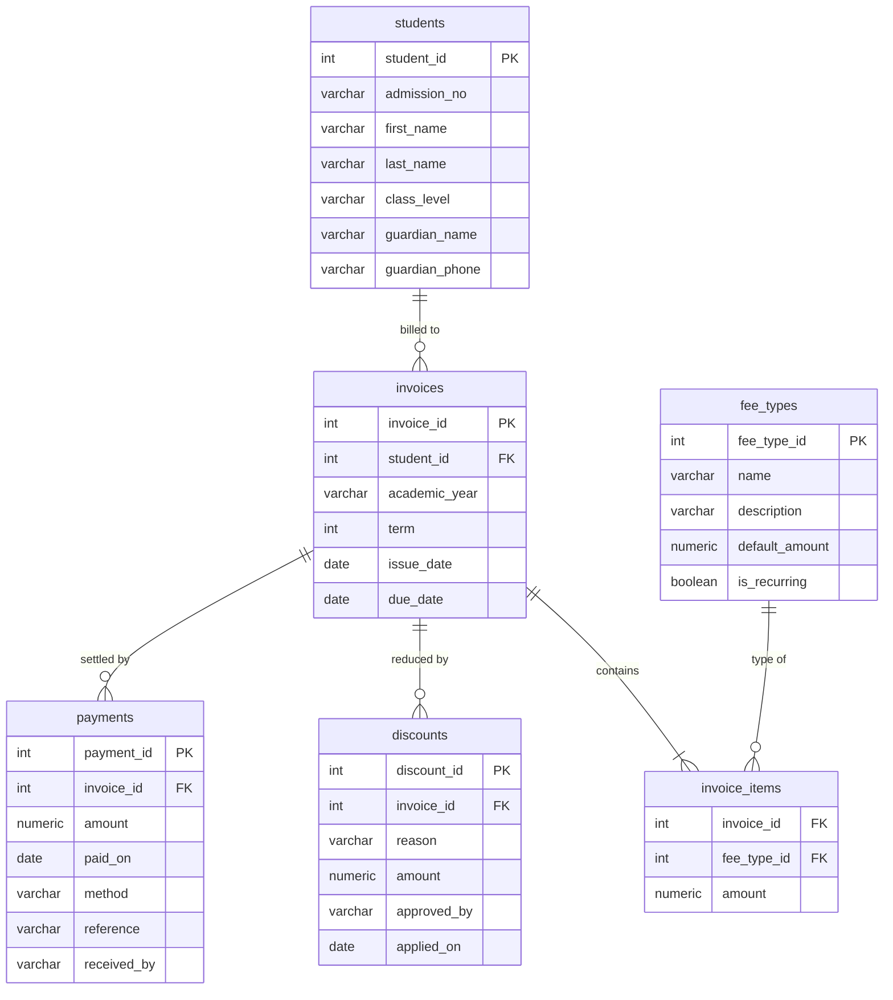

# Entity Relationship Diagram

```mermaid
erDiagram
    students ||--o{ invoices : "billed to"
    invoices ||--|{ invoice_items : contains
    fee_types ||--o{ invoice_items : "type of"
    invoices ||--o{ discounts : "reduced by"
    invoices ||--o{ payments : "settled by"

    students {
        int student_id PK
        varchar admission_no
        varchar first_name
        varchar last_name
        varchar class_level
        varchar guardian_name
        varchar guardian_phone
    }
    fee_types {
        int fee_type_id PK
        varchar name
        varchar description
        numeric default_amount
        boolean is_recurring
    }
    invoices {
        int invoice_id PK
        int student_id FK
        varchar academic_year
        int term
        date issue_date
        date due_date
    }
    invoice_items {
        int invoice_id FK
        int fee_type_id FK
        numeric amount
    }
    discounts {
        int discount_id PK
        int invoice_id FK
        varchar reason
        numeric amount
        varchar approved_by
        date applied_on
    }
    payments {
        int payment_id PK
        int invoice_id FK
        numeric amount
        date paid_on
        varchar method
        varchar reference
        varchar received_by
    }
```